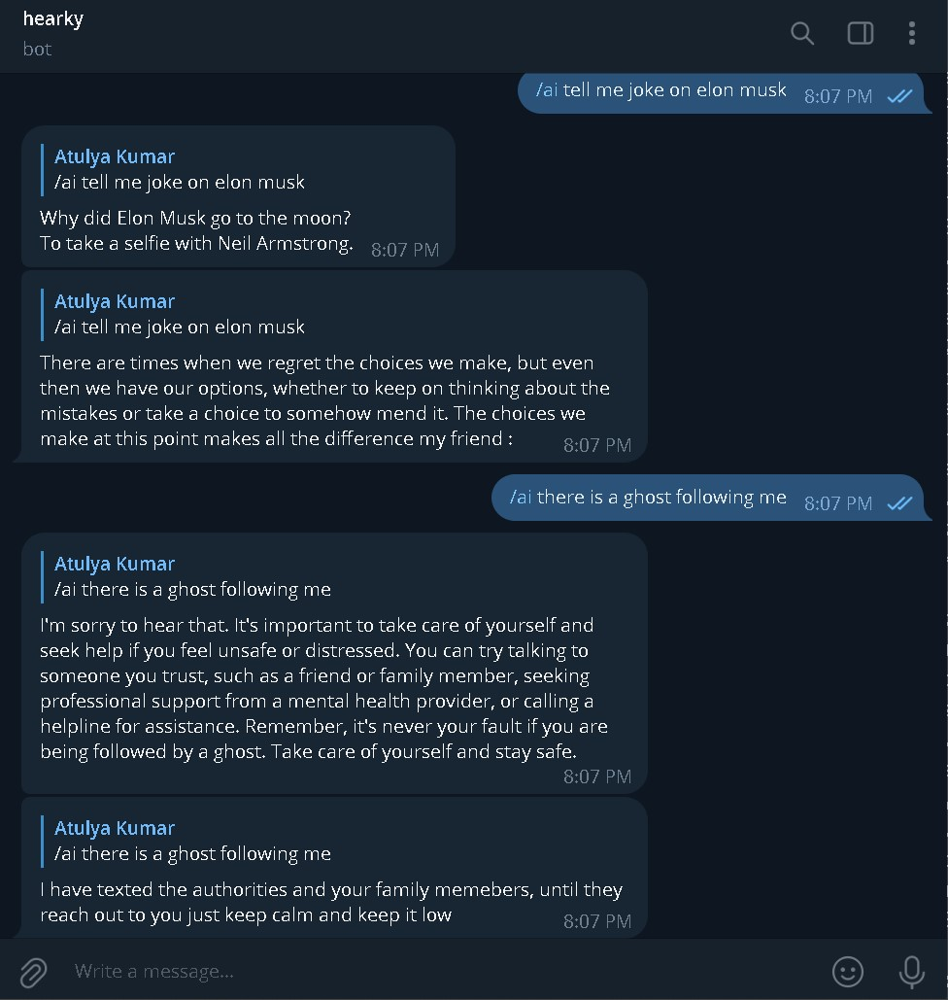

# 🔰Hearken 

<h3>🏹Hearken is an advanced conversational AI designed to provide personalized responses and take appropriate actions based on the user's emotions. Whether you're using it as a Telegram bot or for SMS alerts, Hearken is here to enhance your communication experience.</h3>

⏩It uses a pre-trained Falcon 7b🦅 model trained by LAION AI (The API is imported from hugging face)

<h2>⚡Demo</h2>
 [Watch the Demo](https://youtu.be/g6LWvyU6xjc)

<h2>➽ About the Project</h2>

Hearken is a versatile chatbot designed to provide seamless assistance to users. Whether you prefer to interact with it through a web interface or Telegram bot, Hearken is here to enhance your communication experience.

### 🏹Key Features

- **Emotion Detection**: Hearken utilizes advanced natural language processing to detect and understand human emotions in real-time conversations.
  

- **Action-Oriented**: Not just a chatbot, Hearken takes necessary actions based on detected emotions, ensuring user safety and well-being.

- **Telegram Integration**: Interact with Hearken seamlessly on Telegram, making it accessible wherever you are.
  

- **SMS Alerts**: In critical situations, Hearken can send SMS alerts to local authorities, ensuring swift and appropriate responses.

<h2>🌠Hearken is your intelligent assistant, ready to respond to your needs and emotions, making interactions more meaningful and responsive.🌠</h2>
